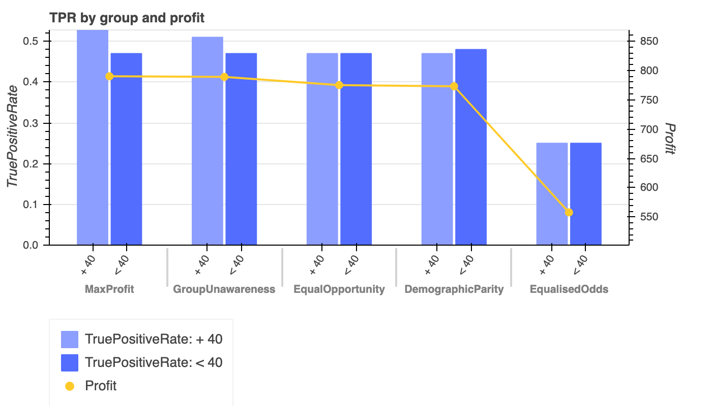

# Bokeh Data Viz Catalogue

You can copy-paste the file `plot_functions.py` into your project to import and use any of the plotting functions.

## Instructions
Download this repo as ZIP file (or git clone it).

View the README.md file on Github or open the corresponding html file in your web browser to display the charts and 
some basic instructions.

Each folder contains a working version of a chart. You can always decide to edit the files to tweak things.

 All plot functions are available in `plot_functions.py`, which can be added, edited and re-used in any of your 
 projects.
 
 ## Current Graphs
 * [Dual bar chart on the left axis and line chart on the right axis](https://github.com/valeria-io/bokeh-vis-functions/tree/master/dual_axis_bar_line_plot)
 
 
 
 ## Contact