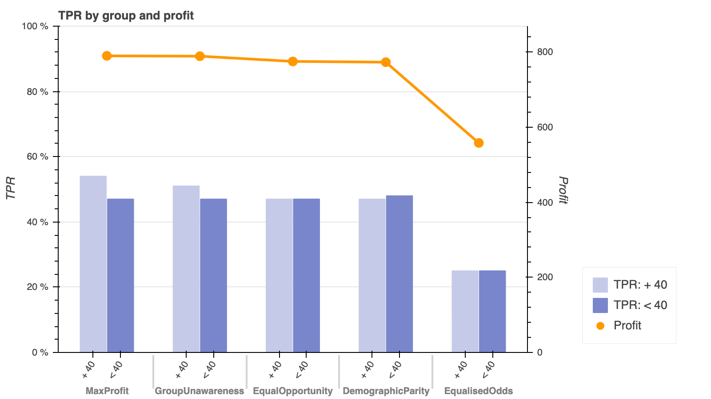
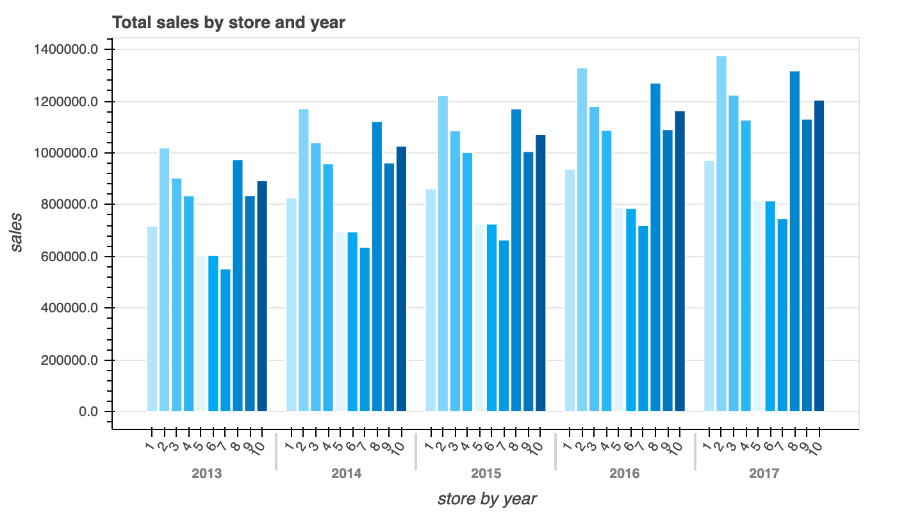
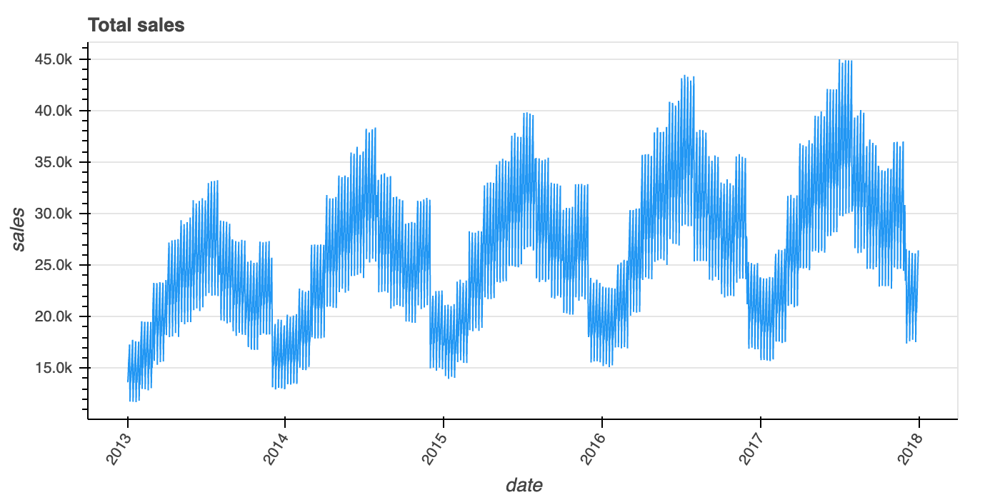
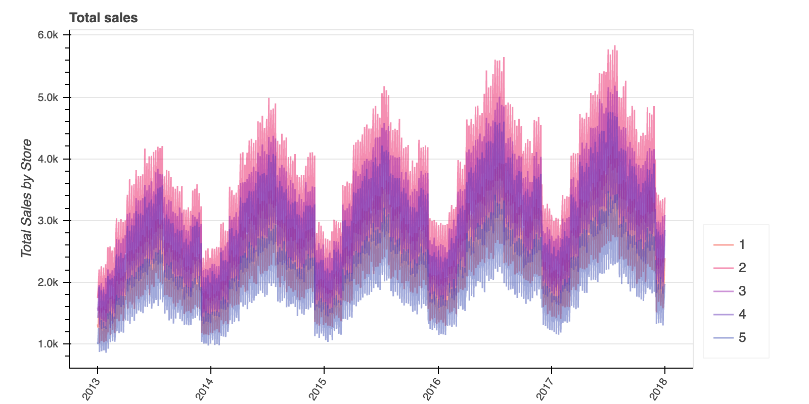

**This is a work in progress. More coming soon :)**

# Bokeh Data Viz Catalogue
This is a collection of Bokeh functions to create interactive data visualisations with large datasets from Python.

You can copy-paste the file `plot_functions.py` into your project to import and use any of the existing plotting 
functions.

## Instructions

Download this repo as ZIP file (or git clone it).

View the README.md file on Github or open the corresponding html file in your web browser to display the charts and 
some basic instructions.

Each folder contains a working version of a chart. You can always decide to edit the files to tweak things.

 All plot functions are available in `plot_functions.py`, which can be added, edited and re-used in any of your 
 projects.
 
## Catalogue
 
 |[Dual bar and line chart](https://github.com/valeria-io/bokeh-vis-functions/tree/master/dual_axis_bar_line_plot) | [Multiple bar chart](https://github.com/valeria-io/bokeh-dataviz-catalogue/tree/master/multiple_bar_plot)|
 | :---: | :---:|
 || |
 |**[Single line chart](https://github.com/valeria-io/bokeh-dataviz-catalogue/tree/master/line_plot)**|**[Multiple line chart](https://github.com/valeria-io/bokeh-dataviz-catalogue/tree/master/multiple_line_plot)**|
 |||   
 
## Contact

- Valeria Cortez, [me@valeria.io](https://twitter.com/ValeriaCortezVD)
- [@ValeriaCortezVD](https://twitter.com/ValeriaCortezVD) on Twitter

## References

- [Bokeh library](https://bokeh.pydata.org/en/latest/)
