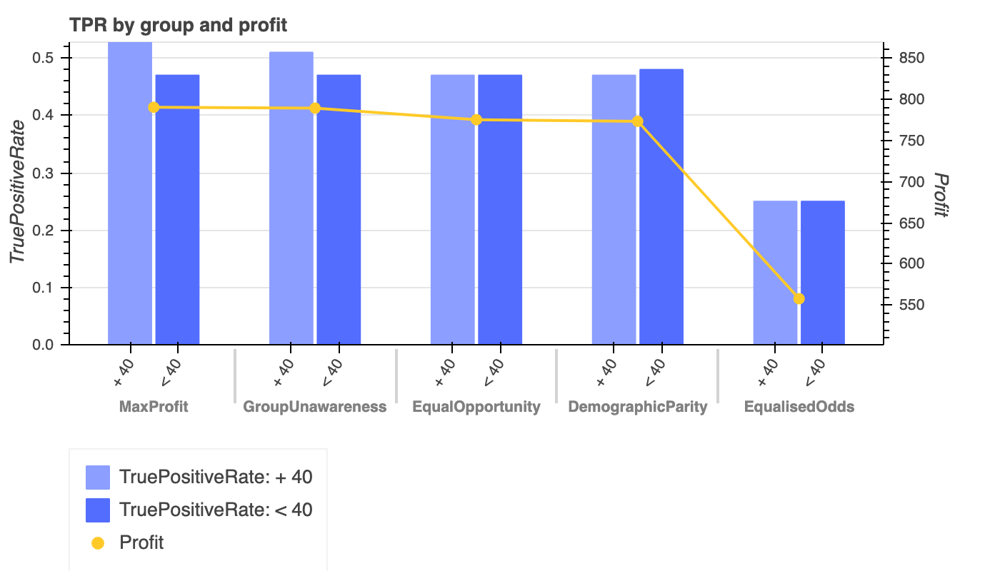
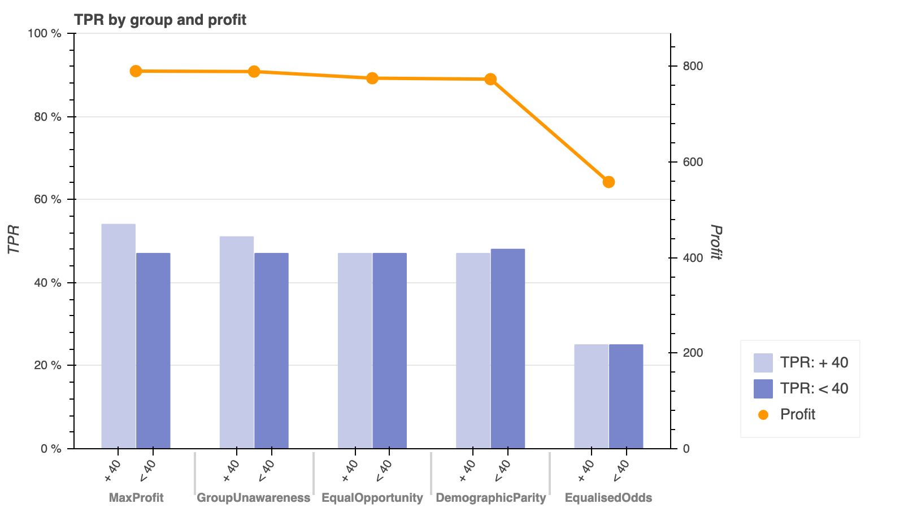

## Graph 1: Function with mandatory parameters

Obligatory parameters are: dataframe, title, group name for the x axis, the column name for the bar variables, the 
column name for the line and the names for the left and right axis values.

```python
plot_dual_axis_dual_bar_line(
    df = df_melt, #pd.DataFrame
    title = "TPR by group and profit", #str
    groups_name = 'IntervationName', #str
    bar_value_name = 'TruePositiveRate', #str
    bar_variable_name = 'GroupName', #str
    line_variable_name = 'Profit', #str
)
```

_To observe the hover functionality, download the HTML page and open in your browser._



### Data used in graph

| IntervationName   |   Profit | GroupName   |   TruePositiveRate |
|-------------------|----------|-------------|--------------------|
| MaxProfit         |      790 | + 40        |               0.54 |
| GroupUnawareness  |      789 | + 40        |               0.51 |
| EqualOpportunity  |      775 | + 40        |               0.47 |
| DemographicParity |      773 | + 40        |               0.47 |
| EqualisedOdds     |      558 | + 40        |               0.25 |
| MaxProfit         |      790 | < 40        |               0.47 |
| GroupUnawareness  |      789 | < 40        |               0.47 |
| EqualOpportunity  |      775 | < 40        |               0.47 |
| DemographicParity |      773 | < 40        |               0.48 |
| EqualisedOdds     |      558 | < 40        |               0.25 |


## Graph 2: Function with additional and optional parameters

In addition to the obligatory parameters, we can add many other optionals as seen in the function below.
```python
plot_dual_axis_dual_bar_line(
    #...all parameters as in the previous graph and optionally:
    left_axis_y_label = "TPR", #str
    right_axis_y_label = "Profit", #str
    plot_height = 450, #int
    plot_width = 800, #int
    bar_colours = ['#039be5' '#29b6f6'], #list
    bar_width = 0.9, #float
    line_colour = "#ff9800", #str
    line_width = 3, #int
    circle_size = 10, #int
    max_left_y_range = 1.0, #float
    min_right_y_range = 0.0, #float
    y_num_tick_formatter = '0 %', #str
    bar_tooltip_format = '{0 %}', #str
    legend_location = (10, 10), #Tuple(int, int)
    legend_placement = "right", #str
    x_range_padding = 0.1, #float
    x_label_orientation = 1.0, #float
    grid_line_colour = None
)
```
Find in this [link](https://bokeh.pydata.org/en/latest/docs/reference/models/formatters.html#bokeh.models.formatters.NumeralTickFormatter) 
the different numerical formats you can use for `y_num_tick_formatter` and `bar_tooltip_format` 
(this last one needs to be in brackets, e.g: `{0 %}`).

_To observe the hover functionality, download the HTML page and open in your browser._



As before, the same table was used:

### Data used in graph


| IntervationName   |   Profit | GroupName   |   TruePositiveRate |
|-------------------|----------|-------------|--------------------|
| MaxProfit         |      790 | + 40        |               0.54 |
| GroupUnawareness  |      789 | + 40        |               0.51 |
| EqualOpportunity  |      775 | + 40        |               0.47 |
| DemographicParity |      773 | + 40        |               0.47 |
| EqualisedOdds     |      558 | + 40        |               0.25 |
| MaxProfit         |      790 | < 40        |               0.47 |
| GroupUnawareness  |      789 | < 40        |               0.47 |
| EqualOpportunity  |      775 | < 40        |               0.47 |
| DemographicParity |      773 | < 40        |               0.48 |
| EqualisedOdds     |      558 | < 40        |               0.25 |


