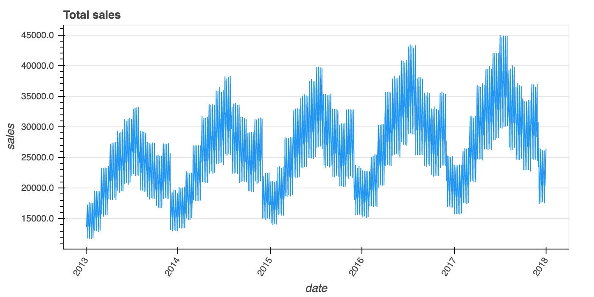
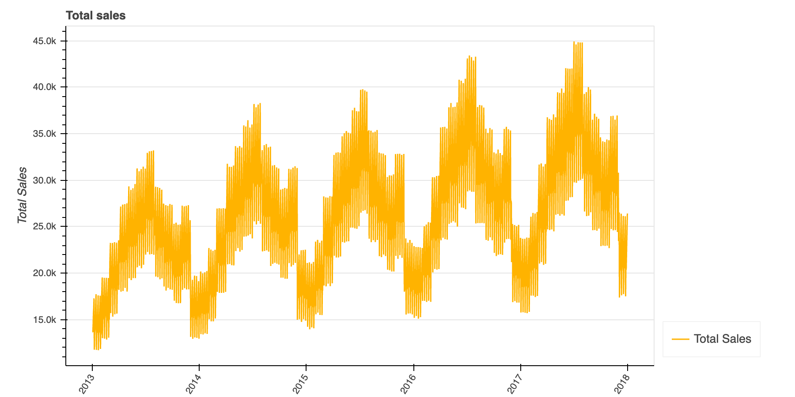

## Graph 1: Function with mandatory parameters

Obligatory parameters are: dataframe, title, column name for the x axis and y axis.

```python
plot_single_line(
    df=df,
    x_axis='date', #str
    y_axis='sales', #str
    title='Total sales' #str
)
```

_To observe the hover functionality, download the HTML page and open in your browser._



### Data used in graph

| date                |   sales | day       |   day_num |
|---------------------|---------|-----------|-----------|
| 2013-01-01 00:00:00 |   13696 | Tuesday   |         1 |
| 2013-01-02 00:00:00 |   13678 | Wednesday |         2 |
| 2013-01-03 00:00:00 |   14488 | Thursday  |         3 |
| 2013-01-04 00:00:00 |   15677 | Friday    |         4 |
| 2013-01-05 00:00:00 |   16237 | Saturday  |         5 |
| 2013-01-06 00:00:00 |   17291 | Sunday    |         6 |
| 2013-01-07 00:00:00 |   11769 | Monday    |         0 |
| 2013-01-08 00:00:00 |   13560 | Tuesday   |         1 |
|...|...|...|...|


## Graph 2: Function with additional and optional parameters

In addition to the obligatory parameters, we can add many other optionals as seen in the function below.
```python
plot_single_line(
    df=df, #pd.DataFrame
    x_axis='date', #str
    y_axis='sales', #str
    title='Total sales', #str
    show_legend=True, #bool
    colour_name='amber', #str
    colour_code='600', #str
    plot_width=900, #int
    plot_height=450, #int
    legend_placement='right', #str
    line_width=1.5, #float
    y_num_tick_formatter='0.0a', #str
    y_axis_label='Total Sales', #str
    x_axis_label='' #str
)
```
In this case, we're using the colour `amber` from Material Design and the colour code `600`, which defines the type of 
amber colour that should be used. You can still assign a preferred hex colour, by setting `md_design_colour=False` and
passing a hex code as as `line_colour='#2196f3'`

Below you can find the list of colour names available for Material Design:
- red, pink, purple, deeppurple, indigo, blue, lightblue, cyan, teal, green, lightgreen, lime, yellow, amber, orange, 
deeporange, brown, grey, bluegrey


In [this link](https://material-ui.com/customization/color/#color-palette) you can see each shade and its respective 
colour code. 

_Find in this [link](https://bokeh.pydata.org/en/latest/docs/reference/models/formatters.html#bokeh.models.formatters.NumeralTickFormatter) 
the different numerical formats you can use for `y_num_tick_formatter` and `bar_tooltip_format` 
(this last one needs to be in brackets, e.g: `{0 %}}`)

_To observe the hover functionality, download the HTML page and open in your browser._



As before, the same table was used:

### Data used in graph

| date                |   sales | day       |   day_num |
|---------------------|---------|-----------|-----------|
| 2013-01-01 00:00:00 |   13696 | Tuesday   |         1 |
| 2013-01-02 00:00:00 |   13678 | Wednesday |         2 |
| 2013-01-03 00:00:00 |   14488 | Thursday  |         3 |
| 2013-01-04 00:00:00 |   15677 | Friday    |         4 |
| 2013-01-05 00:00:00 |   16237 | Saturday  |         5 |
| 2013-01-06 00:00:00 |   17291 | Sunday    |         6 |
| 2013-01-07 00:00:00 |   11769 | Monday    |         0 |
| 2013-01-08 00:00:00 |   13560 | Tuesday   |         1 |
|...|...|...|...|


