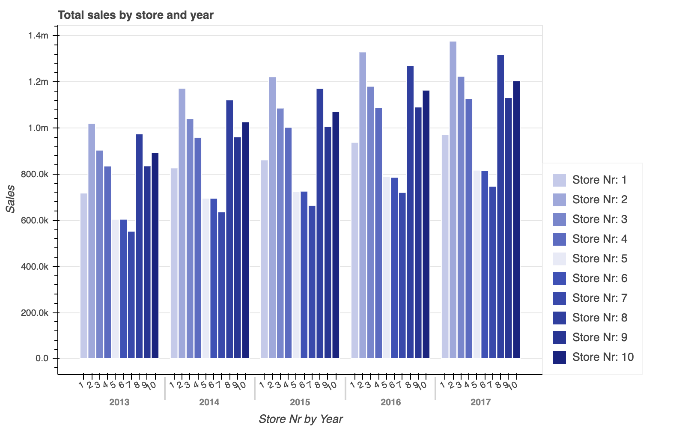

## Graph 1: Function with mandatory parameters

Obligatory parameters are: title and names for the x axis, y axis and x_axis categories 

```python
plot_multiple_bar_chart(
    df, #pd.DataFrame
    title='Total sales by store and year', #str
    x_axis='year', #str
    y_axis='sales', #str
    x_axis_categories='store', #str
)
```
_To observe the hover functionality, download the HTML page and open in your browser._



### Snapshot of data used in graph

|   year |   store | sales     |
|--------|---------|-----------|
|   2013 |       1 | 717,840   |
|   2013 |       2 | 1,020,238 |
|   2013 |       3 | 903,936   |
|   2013 |       4 | 835,059   |
|   2013 |       5 | 603,783   |
|   2013 |       6 | 604,373   |
|   2013 |       7 | 552,223   |
|   2013 |       8 | 974,655   |
|   2013 |       9 | 835,788   |
|   2013 |      10 | 893,348   |
|   2014 |       1 | 826,786   |
|   2014 |       2 | 1,171,797 |
|   2014 |       3 | 1,040,520 |
|   ... |       ... | ... |


## Graph 2: Function with additional and optional parameters

In addition to the obligatory parameters, we can add many other optionals as seen in the function below.
```python
plot_multiple_bar_chart(
    #...all parameters as in the previous graph and optionally:
    df, #pd.DataFrame
    title='Total sales by store and year', #str
    x_axis='year', #str
    y_axis='sales', #str
    x_axis_categories='store', #str
    md_color_shade='indigo', #str (see list of colours below the code)
    bar_width=0.95, #float
    y_tooltip_format='{0,0}', #str
    y_num_tick_formatter='0.0a', #str
    plot_width=800, #int
    plot_height=500, #int
    x_label_orientation=0.5, #float
    y_axis_label='Sales', #str
    x_axis_label='Year', #str
    x_categories='Store Nr', #str
    show_legend=True #bool
)
```
_Find in this [link](https://bokeh.pydata.org/en/latest/docs/reference/models/formatters.html#bokeh.models.formatters.NumeralTickFormatter) 
the different numerical formats you can use for `y_num_tick_formatter` and `bar_tooltip_format` 
(this last one needs to be in brackets, e.g: `{0 %}`)

The `md_color_shade` is a one of the following colour names used in [Material Design](https://material-ui.com/customization/color/#color-palette):
red, pink, purple, deeppurple, indigo, blue, lightblue, cyan, teal, green, lightgreen, lime, yellow, amber, orange, 
deeporange, brown, grey, bluegrey

_To observe the hover functionality, download the HTML page and open in your browser._


As before, the same table was used:

### Snapshot of data used in graph

|   year |   store | sales     |
|--------|---------|-----------|
|   2013 |       1 | 717,840   |
|   2013 |       2 | 1,020,238 |
|   2013 |       3 | 903,936   |
|   2013 |       4 | 835,059   |
|   2013 |       5 | 603,783   |
|   2013 |       6 | 604,373   |
|   2013 |       7 | 552,223   |
|   2013 |       8 | 974,655   |
|   2013 |       9 | 835,788   |
|   2013 |      10 | 893,348   |
|   2014 |       1 | 826,786   |
|   2014 |       2 | 1,171,797 |
|   2014 |       3 | 1,040,520 |
|   ... |       ... | ... |