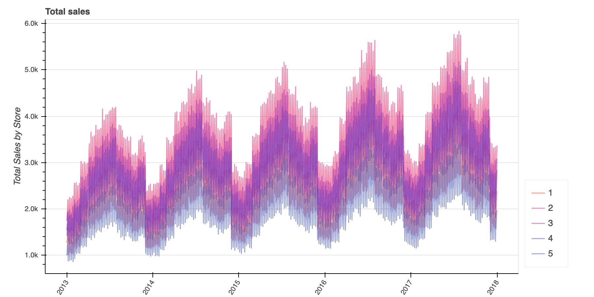

## Graph 1: Function with mandatory parameters

Obligatory parameters are: dataframe, title, column name for the x axis and y axis.

```python
plot_multiple_lines(
    df=df, #pd.DataFrame
    x_axis='date', #str
    y_axis='sales', #str
    category_column='store', #str
    title='Total sales', #str
)
```

_To observe the hover functionality, download the HTML page and open in your browser._


### Data used in graph

| date       |   store |   sales |
|------------|---------|---------|
| 2013-01-01 |       1 |    1316 |
| 2013-01-01 |       2 |    1742 |
| 2013-01-01 |       3 |    1588 |
| 2013-01-01 |       4 |    1423 |
| 2013-01-01 |       5 |    1032 |
| 2013-01-02 |       5 |     997 |
| 2013-01-02 |       3 |    1538 |
| 2013-01-02 |       4 |    1432 |
| 2013-01-02 |       1 |    1264 |
| 2013-01-02 |       2 |    1808 |
|...|...|...|

## Graph 2: Function with additional and optional parameters

In addition to the obligatory parameters, we can add many other optionals as seen in the function below.
```python
plot_multiple_lines(
    df=df, #pd.DataFrame
    x_axis='date', #str
    y_axis='sales', #str
    category_column='store', #str
    title='Total sales', #str
    show_legend=True, #bool
    plot_width=900, #int
    plot_height=450, #int
    legend_placement='right', #str
    line_width=1.5, #float
    line_alpha=0.5, #float
    y_num_tick_formatter='0.0a', #str
    y_axis_label='Total Sales by Store', #str
    x_axis_label='' #str
)
```
Find in [this link](https://bokeh.pydata.org/en/latest/docs/reference/models/formatters.html#bokeh.models.formatters.NumeralTickFormatter) 
the different numerical formats you can use for `y_num_tick_formatter` and `bar_tooltip_format` 
(this last one needs to be in brackets, e.g: `{0 %}`).

_To observe the hover functionality, download the HTML page and open in your browser._



As before, the same table was used:

### Data used in graph

| date       |   store |   sales |
|------------|---------|---------|
| 2013-01-01 |       1 |    1316 |
| 2013-01-01 |       2 |    1742 |
| 2013-01-01 |       3 |    1588 |
| 2013-01-01 |       4 |    1423 |
| 2013-01-01 |       5 |    1032 |
| 2013-01-02 |       5 |     997 |
| 2013-01-02 |       3 |    1538 |
| 2013-01-02 |       4 |    1432 |
| 2013-01-02 |       1 |    1264 |
| 2013-01-02 |       2 |    1808 |
|...|...|...|


